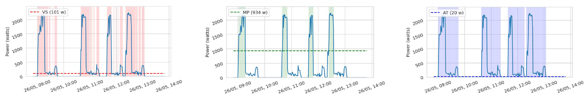
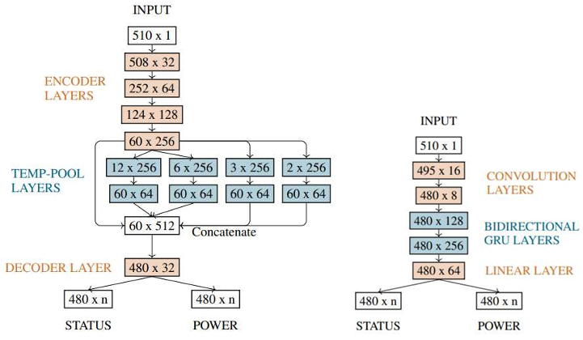

# awesome-NILM-with-code 

> A repository of awesome Non-Intrusive Load Monitoring(NILM) with code

# Toolkits

- NILMTK: Non-Intrusive Load Monitoring Toolkit [[PDF](https://arxiv.org/pdf/1404.3878v1.pdf)] [[CODE](https://github.com/nilmtk/nilmtk)]
- NILMTK-Contrib [[PDF](https://dl.acm.org/doi/10.1145/3360322.3360844)] [[Model](https://nipunbatra.github.io/papers/2021/buildsys.pdf)] [[Tensorflow](https://github.com/nilmtk/nilmtk-contrib)]
- NILM-Eval [[Matlab](https://github.com/beckel/nilm-eval)]
- Torch-NILM [[PDF](https://www.mdpi.com/1996-1073/15/7/2647)] [[Pytorch](https://github.com/Virtsionis/torch-nilm)]
- Deep-NILMtk [[PDF](http://nilmworkshop.org/2022/proceedings/nilm22-final4.pdf)] [[Pytorch](https://github.com/BHafsa/deep-nilmtk-v1/tree/master/deep_nilmtk/models/pytorch)] [[Tensorflow](https://github.com/BHafsa/deep-nilmtk-v1/tree/master/deep_nilmtk/models/tensorflow)]

# Datasets

|               Type                |                           Dataset                            |
| :-------------------------------: | :----------------------------------------------------------: |
|     **Residential datasets**      | [[UK-DALE](https://www.nature.com/articles/sdata20157)] [[REDD](https://energy.duke.edu/content/reference-energy-disaggregation-data-set-redd)] [[REFIT](https://pureportal.strath.ac.uk/en/datasets/refit-electrical-load-measurements-cleaned)] [[AMpds/2](http://ampds.org/)] [[Dataport](https://ieee-dataport.org/keywords/nilm)] [[ECO](http://www.vs.inf.ethz.ch/res/show.html?what=eco-data)] [[ENERTALK](https://www.nature.com/articles/s41597-019-0212-5)] [[iAWE](https://iawe.github.io/)] [[BLUED](http://portoalegre.andrew.cmu.edu:88/BLUED/)] [[PLAID](https://www.nature.com/articles/s41597-020-0389-7)] [[DRED](https://www.st.ewi.tudelft.nl/~akshay/dred/)] [[Georges Hebrail UCI](https://archive.ics.uci.edu/ml/datasets/individual%2Bhousehold%2Belectric%2Bpower%2Bconsumption)] [[GREEND](https://sourceforge.net/projects/greend/)] [[HES](https://randd.defra.gov.uk/ProjectDetails?ProjectID=17359&FromSearch=Y&Publisher=1&SearchText=EV0702&SortString=ProjectCode&SortOrder=Asc&Paging=10#Description)] [[TraceBase](https://github.com/areinhardt/tracebase)] [[IDEAL](https://www.nature.com/articles/s41597-021-00921-y)] |
| **Commercial buildings datasets** |            [[COMBED](https://combed.github.io/)]             |
|      **Industrial datasets**      | [[Industrial Machines Dataset](https://ieee-dataport.org/open-access/industrial-machines-dataset-electrical-load-disaggregation)] [[Aachen Smart Factory](http://www.finesce.eu/Trial_Site_Aachen.html)] [[HIPE](https://www.energystatusdata.kit.edu/hipe.php)] |
|        **Synthetic Data**         | [[SynD](https://github.com/klemenjak/SynD/)] [[COLD](https://github.com/arx7ti/cold-nilm)] [[FIRED](https://github.com/voelkerb/FIRED_dataset_helper)] [[SHED](https://nilm.telecom-paristech.fr/shed/)] [[smartsim](https://github.com/sustainablecomputinglab/smartsim)] |

# Papers

## Reviews

- NILM applications: Literature review of learning approaches, recent developments and challenges [[PDF](https://www.sciencedirect.com/science/article/abs/pii/S0378778822001220)][2022]

- Review on Deep Neural Networks Applied to Low-Frequency NILM [[PDF](https://www.mdpi.com/1996-1073/14/9/2390)][2021]

## Methods

### Thresholding Methods in Non-Intrusive Load Monitoring to Estimate Appliance Status

> We treat three different thresholding methods to perform this task, discussing their differences on various devices from the UK-DALE dataset. [[PDF](https://www.researchsquare.com/article/rs-1923023/v1)] [[Pytorch](https://github.com/UCA-Datalab/nilm-thresholding)]

Sample from the washing machine power load sequence, depicting how different thresholding methods classify each instance as ON or OFF. (a) Variance-Sensitive. (b) Middle-Point. (c) Activation-Time.

Architecture of each model. There are two possible outputs, the model trains differently depending of which output we chose. (a) CONV. (b) GRU.

