

# 🌟 awesome-NILM-with-code

**A curated list of Non-Intrusive Load Monitoring (NILM) papers — every entry ships with code.**

> 😸 Welcome valuable opinions from researchers in the same direction

---

## 📑 Contents

| | |
| :--- | :--- |
| 🧰 [Toolkits](#-toolkits) | 🏫 [Conferences](#-conferences) |
| 📊 [Datasets](#-datasets) | 📄 [Papers](#-papers) |
| 🆕 [2025 – 2026](#-2025--2026) | 📆 [2023 – 2024](#-2023--2024) |
| 📂 [2020 – 2022](#-2020--2022) | 🏛️ [Classics · 2015 – 2019](#-classics--2015--2019) |
| 📚 [Reviews](#-reviews) | 🚀 [Deployment](#-deployment) |
| 🔥 [Recent Updates](#-recent-updates) | ⭐ [Star History](#-star-history) |

> 💡 **Reading guide** — every paper is a *card*: a title, one summary paragraph, and badge links to the **paper** and the **code**. Older work is folded into collapsible year blocks so the front page stays scannable — click a year to expand it.

---

## 🔥 Recent Updates

| Date | Change |
| :--- | :--- |
| **2026-09** | 📦 Redesigned README into **modular, year-grouped cards** with badge links; older entries folded into collapsible year blocks.   🆕 Added **MSDCANet** (DSP 2026), **DualNILM** (PV-injection aware), **NILMFormer** (KDD 2025), **training-free LLM NILM**, **diffusion-based augmentation** (Energy 2025), **MATNilm**, **Tsetlin Machine NILM on MCUs** (2026).   🐛 Fixed broken links: MSDC (Google redirect ⇒ AAAI official), GRAD-NILM PDF, attention-NILM code, HawkDATA, nilmworkshop.   🧹 De-duplicated the federated-learning survey entry and added the CC BY 4.0 license. |

---

# 🧰 Toolkits

| Toolkit | Summary | Stack | Links |
| :--- | :--- | :--- | :--- |
| **NILMTK** | The de-facto standard NILM toolkit: dataset parsers, benchmarking API and statistics |  |   |
| **NILMTK-Contrib** | Community extensions and reference implementations for NILMTK |  |    |
| **NILM-Eval** | Reproducible evaluation framework and baseline algorithms |  |  |
| **Torch-NILM** | Benchmarking suite for deep learning models in energy disaggregation |  |   |
| **Deep-NILMtk** | Modular deep learning NILM toolbox (PyTorch + TensorFlow models) |   |    |
| **nilmtk-ukdale** | Exploratory data analysis pipeline for UK-DALE |  |  |
| **NeuralNILM_Pytorch** | PyTorch re-implementation of *Neural NILM* |  |  |
| **nilm_analyzer** | Disaggregation result inspection and error-analysis utilities |  |  |

---

# 🏫 Conferences

| Venue | Link |
| :--- | :--- |
| 🗞️ **Energy Informatics** |  |
| 🗞️ **NILM Workshop** (annual) |   |
| 🗞️ **ICPERE 2022** |  |

---

# 📊 Datasets

<b>🏠 Residential datasets (17)</b>

 

[UK-DALE](https://www.nature.com/articles/sdata20157) · [REDD](https://energy.duke.edu/content/reference-energy-disaggregation-data-set-redd) · [REFIT](https://pureportal.strath.ac.uk/en/datasets/refit-electrical-load-measurements-cleaned) · [AMPds/2](http://ampds.org/) · [Dataport](https://ieee-dataport.org/keywords/nilm) · [ECO](http://www.vs.inf.ethz.ch/res/show.html?what=eco-data) · [ENERTALK](https://www.nature.com/articles/s41597-019-0212-5) · [iAWE](https://iawe.github.io/) · [BLUED](http://portoalegre.andrew.cmu.edu:88/BLUED/) · [PLAID](https://www.nature.com/articles/s41597-020-0389-7) · [DRED](https://www.st.ewi.tudelft.nl/~akshay/dred/) · [Georges Hebrail (UCI)](https://archive.ics.uci.edu/ml/datasets/individual%2Bhousehold%2Belectric%2Bpower%2Bconsumption) · [GREEND](https://sourceforge.net/projects/greend/) · [HES](https://randd.defra.gov.uk/ProjectDetails?ProjectID=17359&FromSearch=Y&Publisher=1&SearchText=EV0702&SortString=ProjectCode&SortOrder=Asc&Paging=10#Description) · [TraceBase](https://github.com/areinhardt/tracebase) · [IDEAL](https://www.nature.com/articles/s41597-021-00921-y) · [HawkDATA](https://github.com/WZiJ/SenSys24-Hawk)

<b>🏢 Commercial buildings datasets (2)</b>

 

[COMBED](https://combed.github.io/) · [BLOND](https://www.nature.com/articles/sdata201848)

<b>🏭 Industrial datasets (3)</b>

 

[Industrial Machines Dataset](https://ieee-dataport.org/open-access/industrial-machines-dataset-electrical-load-disaggregation) · [Aachen Smart Factory](http://www.finesce.eu/Trial_Site_Aachen.html) · [HIPE](https://www.energystatusdata.kit.edu/hipe.php)

<b>🧪 Synthetic data generators (5)</b>

 

[SynD](https://github.com/klemenjak/SynD/) · [COLD](https://github.com/arx7ti/cold-nilm) · [FIRED](https://github.com/voelkerb/FIRED_dataset_helper) · [SHED](https://nilm.telecom-paristech.fr/shed/) · [smartsim](https://github.com/sustainablecomputinglab/smartsim)

---

# 📄 Papers

## 🆕 2025 – 2026

> 🔥 The newest wave: **non-stationarity-aware Transformers**, **LLMs with zero training**, **diffusion augmentation**, **multi-scale attention** and **PV injection-aware disaggregation**.

### 📌 MSDCANet: A Multi-Scale Dual-Channel Convolutional Attention Network for Non-Intrusive Load Disaggregation

> Most deep NILM models rely on single-scale features and ignore the multi-scale variations caused by appliance mode transitions, which leads to overfitting and to poor separation of similar appliances. MSDCANet integrates multi-scale feature extraction, adaptive normalization and a multi-scale attention mechanism. On UK-DALE and REDD it beats SotA on MAE / SAE / F1 for several high-energy appliances, under both origin-household and cross-household evaluation.

---

### 📌 DualNILM: Energy Injection Identification Enabled Disaggregation with Deep Multi-Task Learning

> Behind-the-meter PV generation breaks NILM's non-negativity assumption — once injection exceeds consumption, disaggregation becomes a severely under-constrained inverse problem. DualNILM is a Transformer-based multi-task framework that unifies sequence-to-point state detection with sequence-to-sequence energy-injection estimation over multi-channel signatures. The authors also release **PV-augmented REDD and UK-DALE** with realistic weather data.

---

### 📌 NILMFormer: Non-Intrusive Load Monitoring that Accounts for Non-Stationarity

> SotA methods slice household consumption into subsequences, but real smart-meter data is **non-stationary** — distribution drift inside each window wrecks model performance. NILMFormer is a seq2seq Transformer with a subsequence stationarization / de-stationarization scheme plus positional encoding that relies only on timestamp information. It was validated on four real-world datasets and has been deployed as the backbone of **EDF's (Électricité de France) consumption monitoring service**, serving millions of customers.

---

### 📌 Prompting Large Language Models for Training-Free Non-Intrusive Load Monitoring

> The first prompt-based NILM framework: it drives LLMs purely through in-context learning, injecting appliance features, timestamps, contextual hints and representative time-series examples into the prompt. Guided by prompts alone, LLMs reach a competitive 0.676 average F1 on unseen REDD households, generalise across houses and even regions without fine-tuning, and emit human-readable explanations for the states they infer.

---

### 📌 A Diffusion Model-Based Framework to Enhance the Robustness of Non-Intrusive Load Disaggregation

> Existing NILM models need a lot of labels, yet public datasets are noisy. This work augments training data with a diffusion model tuned to generate multi-state, low-noise load signatures; mixing synthetic with real data improves disaggregation while shrinking the required training set. A tailored loss function and post-processing step further raise noise resistance, improving MAE / SAE / F1 in both intra- and cross-household scenarios.

---

<b>📆 2023 – 2024</b>

 

### 📌 Hawk: An Efficient NALM System for Accurate Low-Power Appliance Recognition

> Non-intrusive Appliance Load Monitoring recognises individual appliance usage from the main meter with no indoor sensors, but existing systems trade dataset-construction cost against recognition accuracy — especially for low-power appliances. Hawk runs in two stages: it builds **HawkDATA**, a balanced and diverse dataset collected via balanced Gray code and auto-annotated through a *shared perceptible time* synchronisation strategy (1/71.5 of the collection time, 6.34× more state combinations than the baseline), then recognises events with steady-state differential pre-processing plus voting-based post-processing. Average F1: **93.94% state / 97.07% event** recognition (+47.98% / +11.57% over SotA), and deployment in two real-world scenarios with unseen background appliances reached 96.02% and 94.76% event F1.

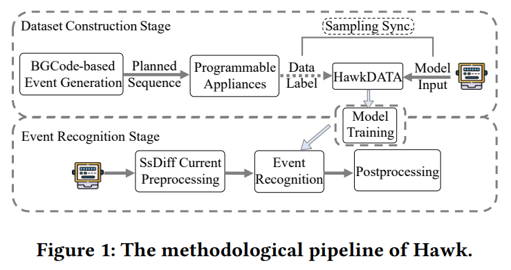

---

### 📌 MATNilm: Multi-Appliance-Task Non-Intrusive Load Monitoring with Limited Labeled Data

> Instead of training one model per appliance on huge labelled corpora, MATNilm proposes a multi-appliance-task framework with a training-efficient **sample augmentation (SA)** scheme: a shared-hierarchical split structure handles regression and classification for each appliance, and a two-dimensional attention mechanism captures spatio-temporal correlations across all of them. With only **one day** of training data, test performance becomes comparable to training on the full dataset, and relative errors drop by more than 50% on average.

---

### 📌 Graph-Based Dependency-Aware Non-Intrusive Load Monitoring (GRAD-NILM)

> Neural NILM models ignore — or only implicitly characterise — the dependencies between simultaneously running appliances. This work builds a weighted adjacency matrix from prior temporal knowledge between working appliances (adding per-appliance hard dependencies to avoid sparsity), learns non-sequential dependencies through a **graph attention network**, and uses a dilated-convolution encoder–decoder to estimate power and detect states at the same time. Evaluated on UK-DALE with clear gains over the SotA models of the time.

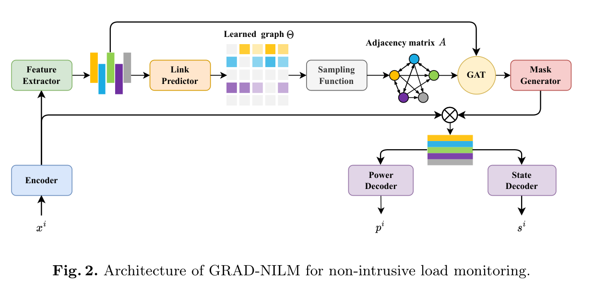

---

### 📌 MSDC: Exploiting Multi-State Power Consumption in Non-Intrusive Load Monitoring Based on a Dual-CNN Model

> MSDC explicitly models an appliance's multiple states and state transitions instead of regressing power alone: one CNN outputs state distributions while the other predicts the power of each state, and conditional random fields (CRF) capture state transitions. On REDD and UK-DALE it significantly outperforms previous SotA models.

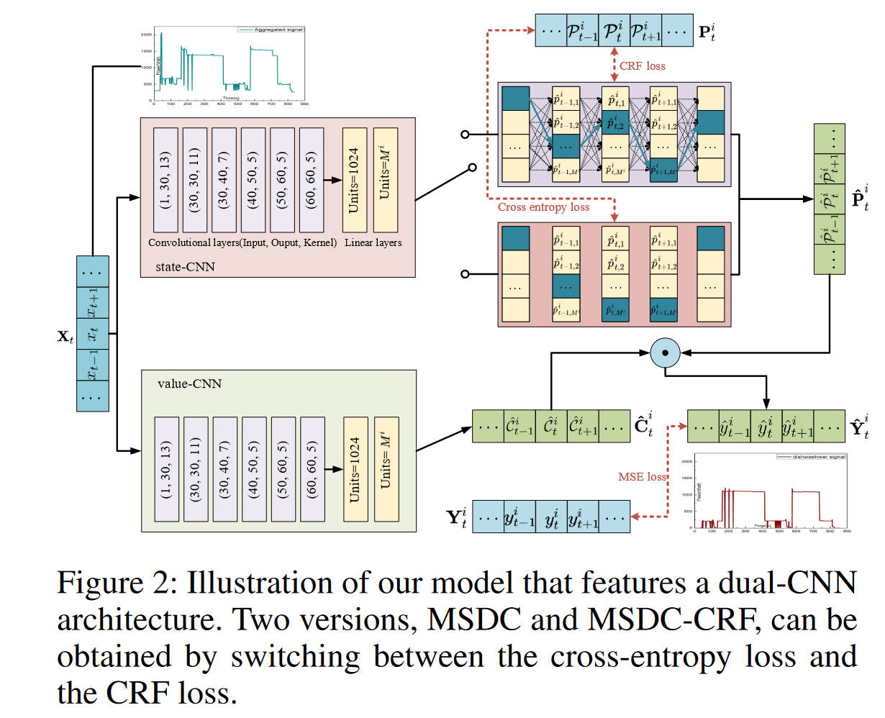

<b>📂 2020 – 2022</b>

 

### 📌 "I do not know": Quantifying Uncertainty in Neural Network Based Approaches for Non-Intrusive Load Monitoring

> Can models tell when they are unsure? The authors evaluate 14 neural variants with uncertainty estimation on REDD and show that uncertainty can be estimated accurately without sacrificing traditional metrics, that different appliances and states differ in how well calibrated they are, and that *recalibration* methods further improve the estimates.

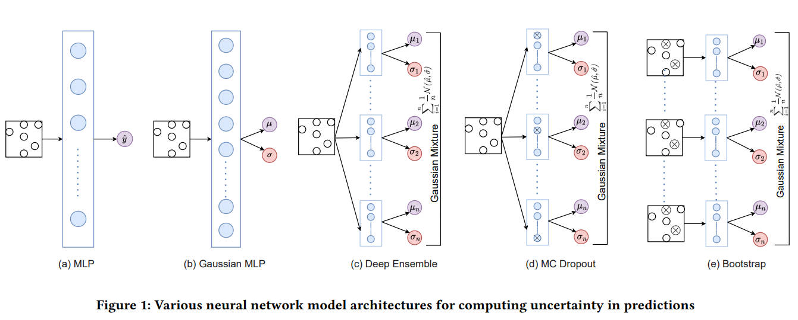

---

### 📌 Fed-GBM: A Cost-Effective Federated Gradient Boosting Tree for Non-Intrusive Load Monitoring

> A collaborative learning framework combining two-stage voting with node-level parallelism, making co-modelling for NILM both privacy-preserving and cost-effective.

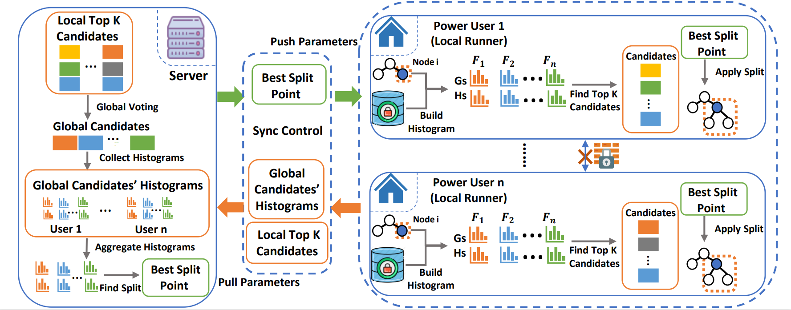

---

### 📌 DeepDFML-NILM: A New CNN-Based Architecture for Detection, Feature Extraction and Multi-Label Classification in NILM Signals

> High-frequency approaches rarely cover the full pipeline. This work delivers an integrated detector → feature extractor → multi-label classifier for high-frequency NILM signals, evaluated on the public LIT-Dataset.

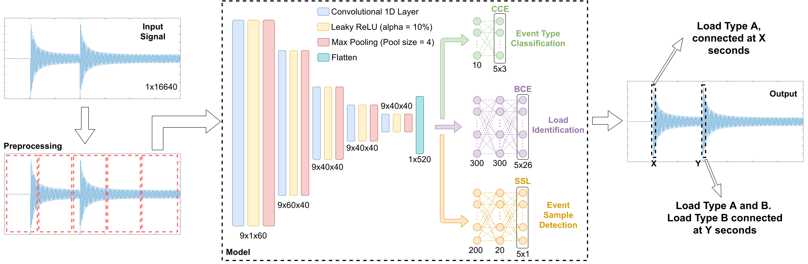

---

### 📌 Thresholding Methods in Non-Intrusive Load Monitoring to Estimate Appliance Status

> Compares three thresholding strategies for turning continuous estimates into on/off statuses, and discusses how they differ across appliances from UK-DALE.

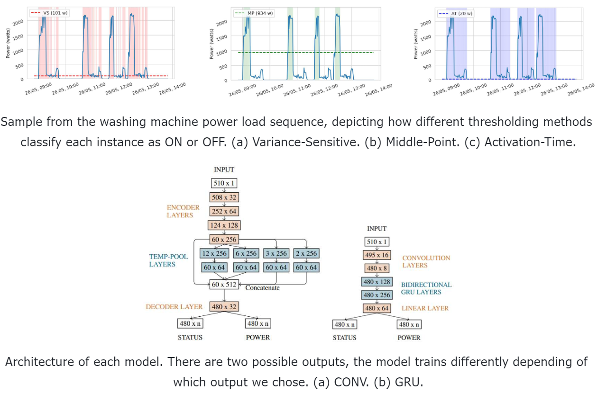

---

### 📌 Multi-Label Appliance Classification with Weakly Labeled Data for Non-Intrusive Load Monitoring

> An appliance classifier built on a convolutional recurrent neural network trained under weak supervision, cutting the annotation burden for multi-label NILM.

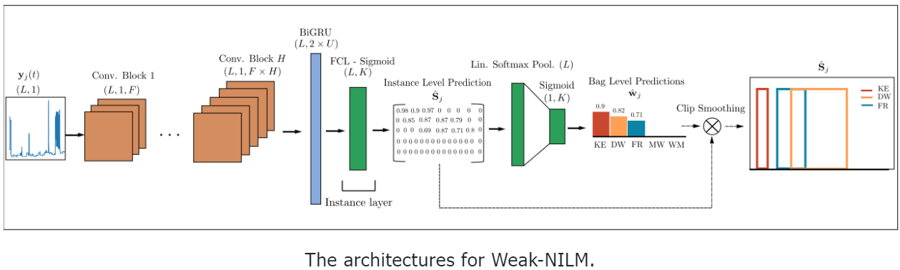

---

### 📌 ELECTRIcity: An Efficient Transformer for Non-Intrusive Load Monitoring

> Uses Transformer layers to estimate appliance-level power, relying entirely on attention mechanisms to capture global dependencies between the aggregate signal and each domestic appliance.

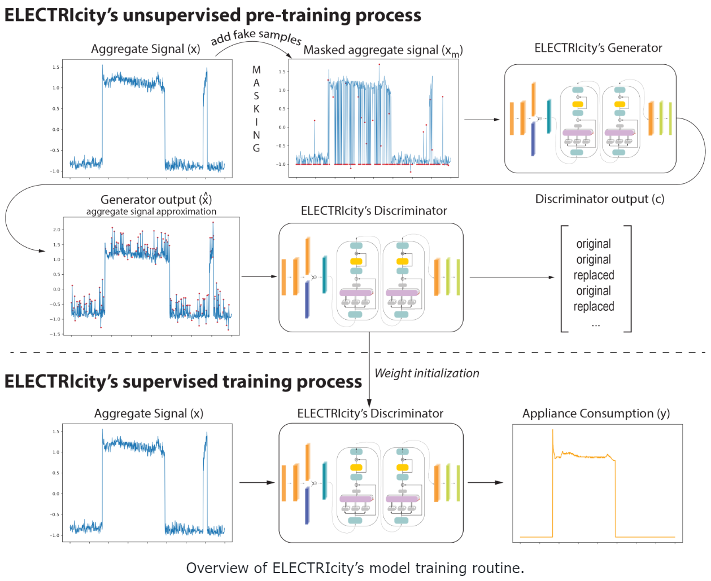

---

### 📌 Learning to Learn Neural Networks for Energy Disaggregation

> Applies *learning to learn* (meta-learning of the optimiser itself) to energy disaggregation, improving both performance and transferability across datasets.

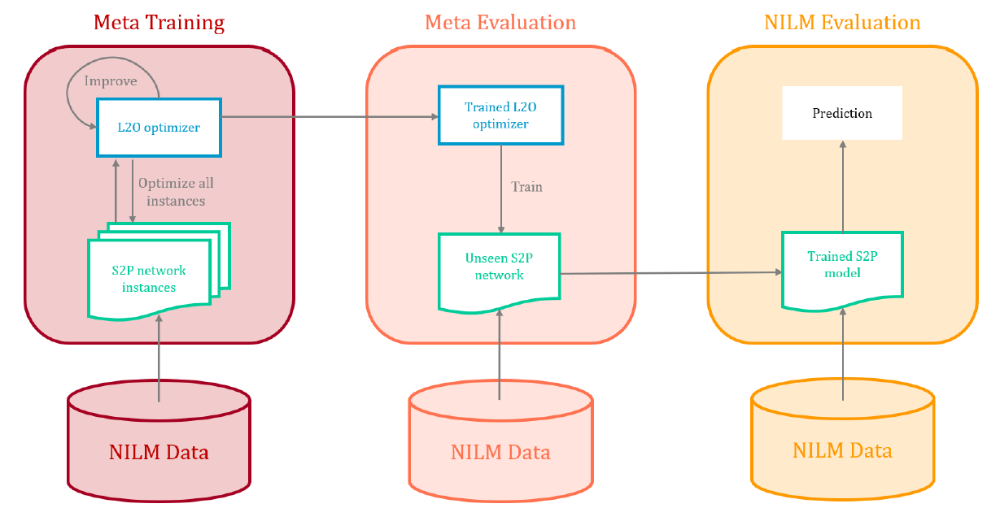

---

### 📌 Deep Learning-Based Non-Intrusive Commercial Load Monitoring

> Introduces **TTRNet**, a multi-label classification network that learns inter-load correlations through its own structure, and **MLFL**, a loss function purpose-built for multi-label imbalance — together improving accuracy on the hardest commercial loads.

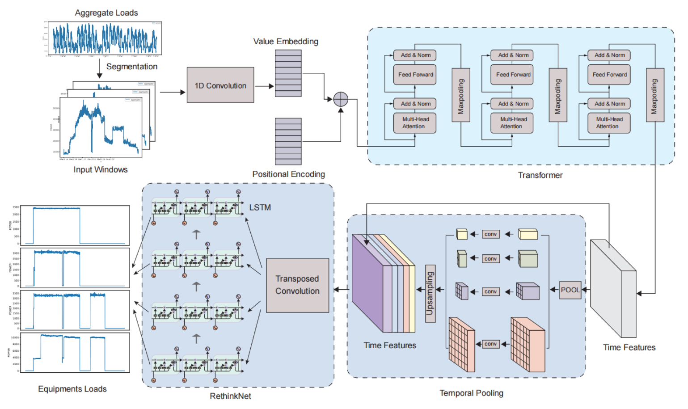

---

### 📌 Improving Non-Intrusive Load Disaggregation through an Attention-Based Deep Neural Network

> Improves the generalisation capability of the architecture by inserting an encoder–decoder with a tailored temporal attention mechanism into the regression subnetwork.

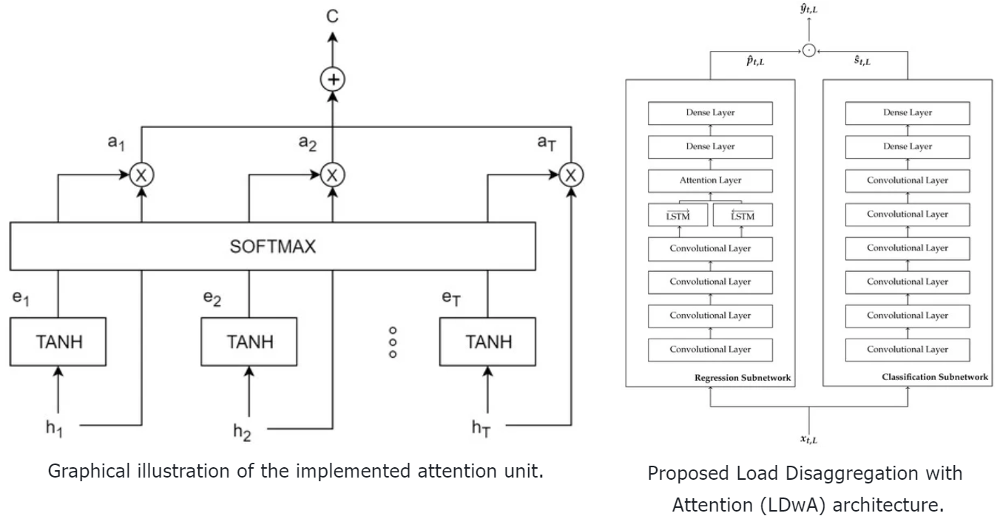

---

### 📌 Energy Disaggregation using Variational Autoencoders

> Casts disaggregation into the variational autoencoder framework, where the probabilistic encoder efficiently encodes the information needed to reconstruct the target appliance's consumption.

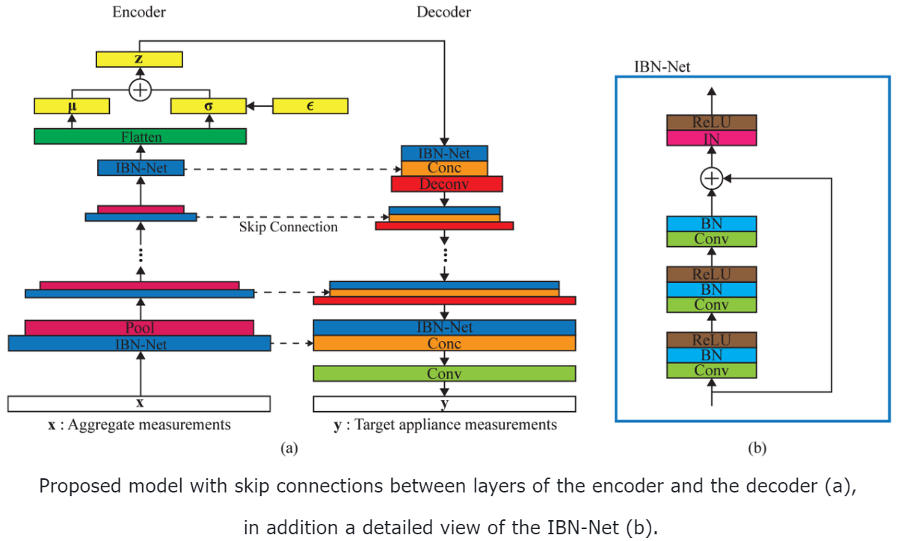

---

### 📌 Sequence to Point Learning Based on Bidirectional Dilated Residual Network for Non-Intrusive Load Monitoring (BitcnNILM)

> Sequence-to-point learning with bidirectional dilated convolutions for low-frequency NILM; on REDD and UK-DALE it improves both load disaggregation and on/off identification.

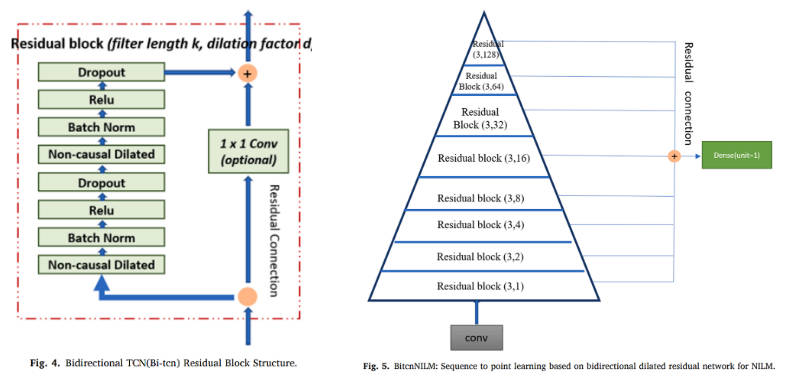

---

### 📌 BERT4NILM: A Bidirectional Transformer Model for Non-Intrusive Load Monitoring

> Adapts BERT-style bidirectional Transformers to energy disaggregation in a sequence-to-sequence fashion, with an improved objective function designed specifically for NILM.

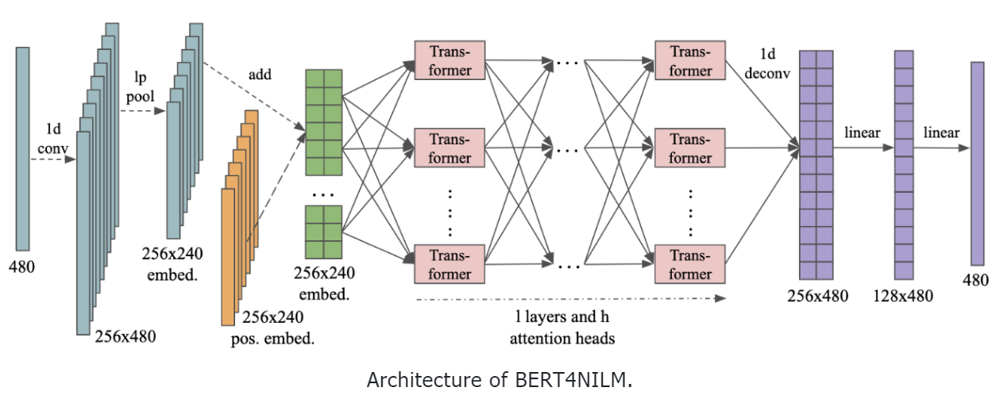

---

### 📌 Generative Adversarial Networks and Transfer Learning for Non-Intrusive Load Monitoring in Smart Grids

> Two GAN-based approaches for high-accuracy disaggregation that also tackle generalisability — via parameter-sharing transfer learning and via compact shared representations between source and target domains — with a quantitative study of how domain similarity affects the transfer payoff.

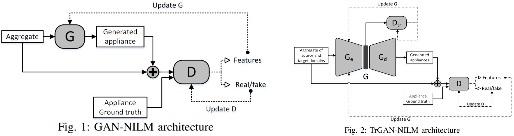

---

### 📌 Exploring Time Series Imaging for Load Disaggregation

> A comparative study of three time-series imaging techniques for NILM — Gramian Angular Fields, Markov Transition Fields and Recurrence Plots.

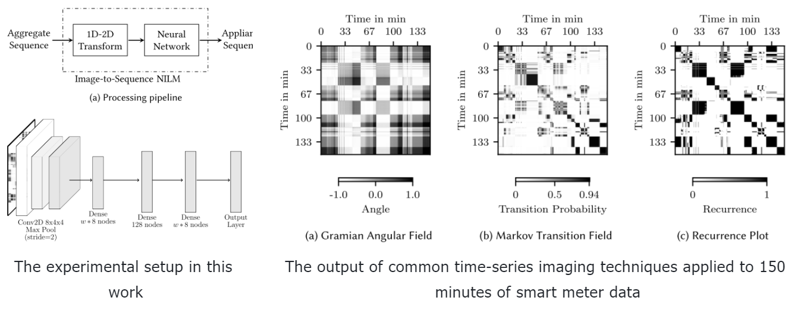

---

### 📌 On Time Series Representations for Multi-Label NILM

> Leverages **Signal2Vec** dimensionality reduction inside a multi-label NILM system, outperforming another state-of-the-art multi-label baseline on two popular public datasets.

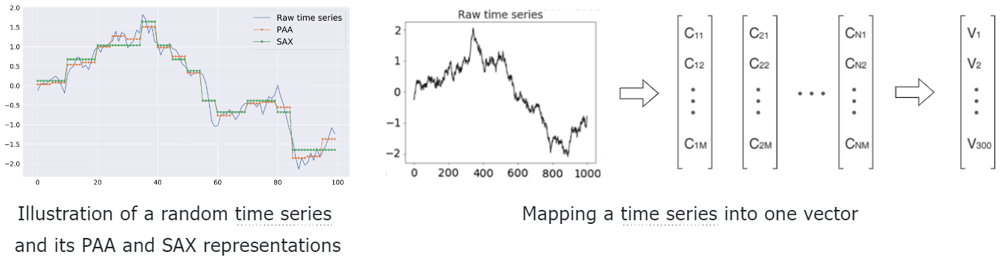

---

### 📌 Improved Appliance Classification in NILM Using Weighted Recurrence Graph and Convolutional Neural Networks

> Introduces the **weighted recurrence graph (WRG)** generated from one cycle of current and voltage — a richer, non-binary image-like representation — and feeds it to a CNN for appliance recognition.

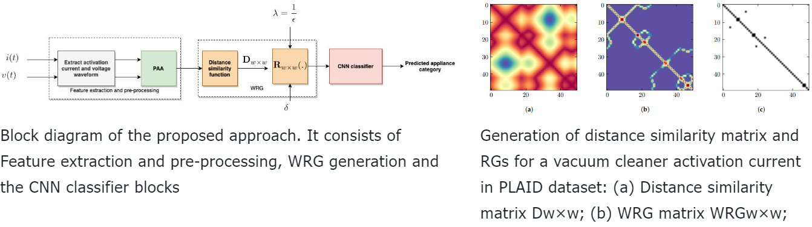

---

### 📌 UNet-NILM: A Deep Neural Network for Multi-Tasks Appliances State Detection and Power Estimation in NILM

> A U-Net variant performing state detection and power estimation jointly, using multi-label learning and multi-target quantile regression.

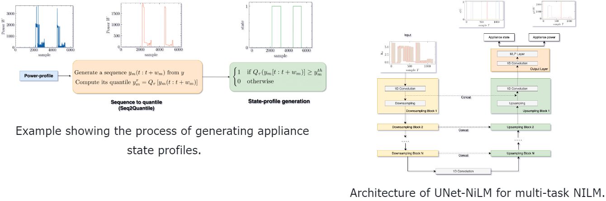

---

### 📌 Non-Intrusive Load Disaggregation by Convolutional Neural Network and Multilabel Classification

> Recognises appliance activation states with a fully convolutional network, borrowing techniques from semantic image segmentation and multi-label classification.

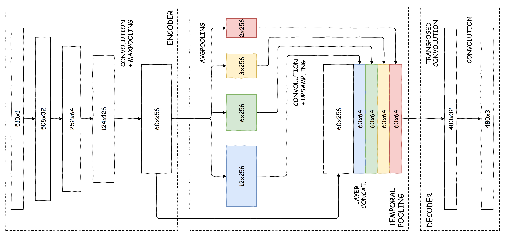

---

### 📌 Multi-Label Learning for Appliances Recognition in NILM using Fryze-Current Decomposition and Convolutional Neural Network

> Applies Fryze power theory to split the current into active and non-active components, converts the decomposition into an image-like representation via Euclidean similarity, and classifies it with a CNN under multi-label learning.

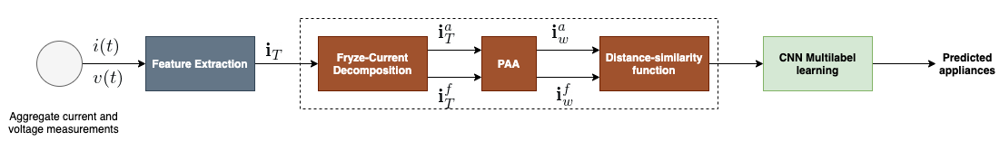

---

### 📌 EdgeNILM: Towards NILM on Edge Devices

> Studies neural network compression schemes against a SotA NILM model and proposes a multi-task learning architecture that compresses the models further — targeting deployment on resource-constrained edge hardware.

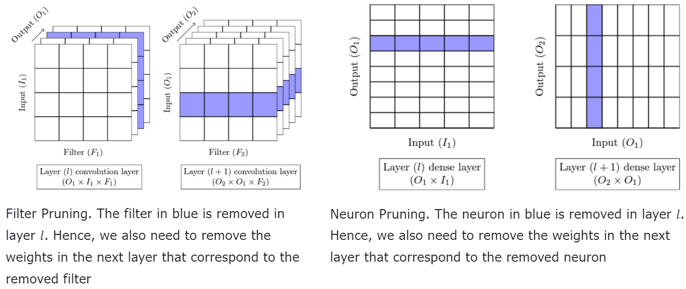

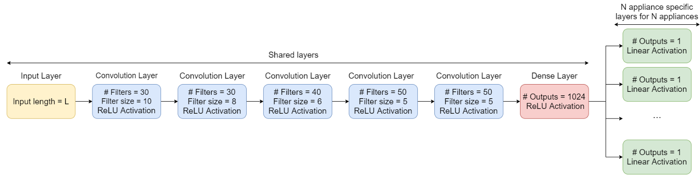

---

### 📌 eeRIS-NILM: An Open Source, Unsupervised Baseline for Real-Time Feedback Through NILM

> An ideal NILM algorithm should be unsupervised and give real-time feedback, yet such solutions are under-studied. eeRIS pairs a lightweight *Live* algorithm (running continuously) with a heavier, more robust NILM procedure, synchronising their appliance models periodically.

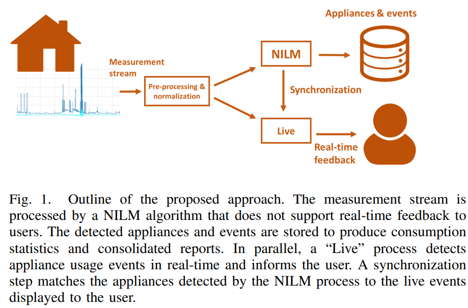

<b>🏛️ Classics · 2015 – 2019</b>

 

### 📌 Deep Learning Based Energy Disaggregation and On/Off Detection of Household Appliances

> Investigates **WaveNet** architectures for energy disaggregation with fast sequence-to-point learning.

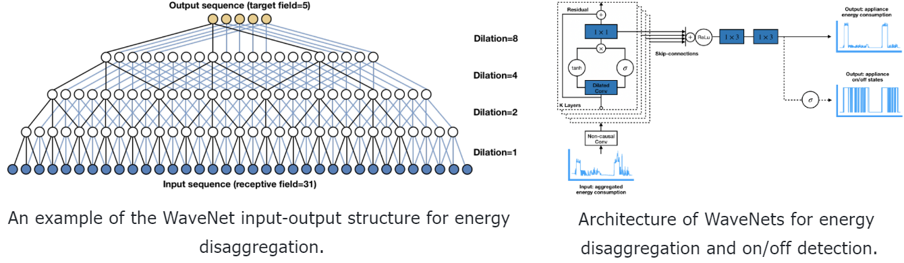

---

### 📌 WaveNILM: A Causal Neural Network for Power Disaggregation from the Complex Power Signal

> A causal 1-D WaveNet-style CNN for low-frequency NILM, plus a study showing that all four complex-power components (current, active, reactive and apparent power) are worth using.

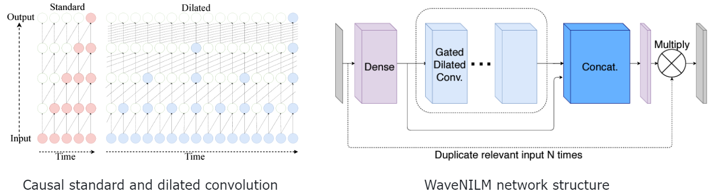

---

### 📌 Transfer Learning for Non-Intrusive Load Monitoring

> The foundational transfer-learning study for NILM, covering both appliance transfer learning (ATL) and cross-domain transfer learning (CTL).

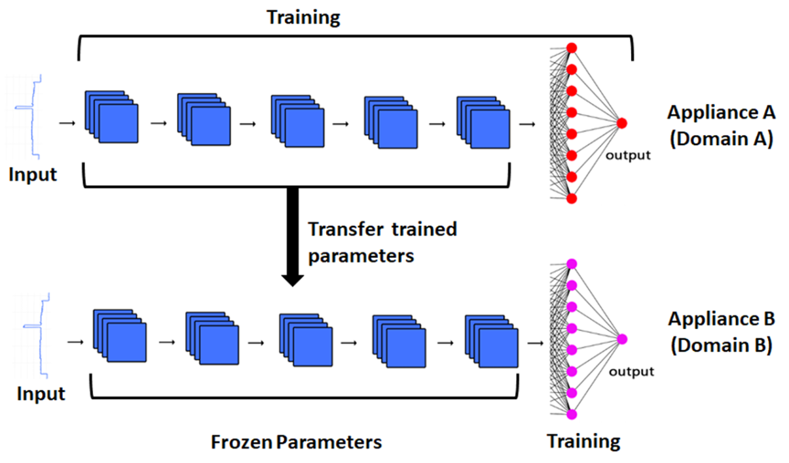

---

### 📌 Sliding Window Approach for Online Energy Disaggregation Using Artificial Neural Networks

> Two recurrent network architectures with a sliding window, designed for real-time energy disaggregation.

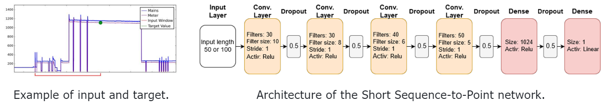

---

### 📌 Subtask Gated Networks for Non-Intrusive Load Monitoring

> Combines the main regression network with an on/off classification subtask network through a gating mechanism.

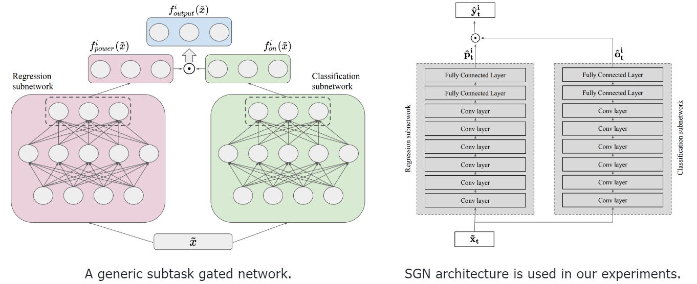

---

### 📌 Sequence-to-Point Learning with Neural Networks for Non-Intrusive Load Monitoring

> ⭐ *The canonical seq2point baseline.* The input is a window of the mains aggregate; the output is a single point of the target appliance.

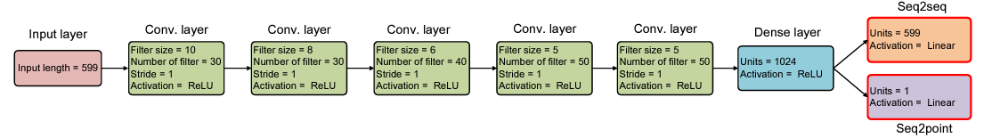

---

### 📌 Neural NILM: Deep Neural Networks Applied to Energy Disaggregation

> 🏛️ *The paper that started deep NILM.* It adapts three DNN architectures to energy disaggregation: a form of RNN called LSTM, denoising autoencoders, and a network that regresses the start time, end time and average power demand of each appliance activation.

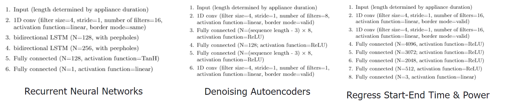

---

## 📚 Reviews

| 📖 Survey | Links |
| :--- | :--- |
| **Neural Load Disaggregation: Meta-Analysis, Federated Learning and Beyond** — emphasises federated neural NILM, where models are trained locally so sensitive data never leaves the home.  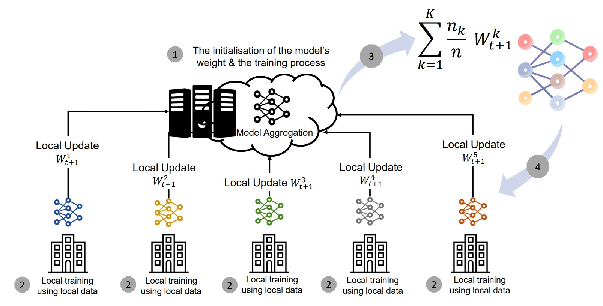 |    |
| **Non-Intrusive Load Monitoring: A Review** — broad review of the field shipped with baseline code. |    |
| **NILM Applications: Literature Review of Learning Approaches, Recent Developments and Challenges** — maps learning-based approaches, recent progress and open challenges. |   |
| **Review on Deep Neural Networks Applied to Low-Frequency NILM** — a focused review of deep architectures for low-frequency smart-meter data. |   |

---

## 🚀 Deployment

> Systems that put NILM onto real hardware — from servers down to 18 KB MCUs.

### 📌 A Real-Time Tsetlin Machine-Based Non-Intrusive Load Monitoring System on MCUs

> Reformulates NILM as a Boolean classification task solved by a **Tsetlin Machine**, reaching 90% precision / 96% recall for two-appliance classification on REDD while using only **18 KB of flash** and **0.43 ms** inference latency on an ESP32 — enabling privacy-preserving, fully on-device NILM.

---

| Project | Stack | Link |
| :--- | :--- | :--- |
| **Energy Management Using Real-Time NILM** | Arduino + Raspberry Pi |  |
| **flask-NILM-app-v1** | Flask web app |  |
| **Inverse Decomposition of Energy Consumption (IDEC)** | C++ |  |

---

# ⭐ Star History

---

**Contributions welcome!** Open an issue or a PR to add your NILM work *with code*.

Made with 💛 for the energy disaggregation community · Licensed under [CC BY 4.0](./LICENSE)

