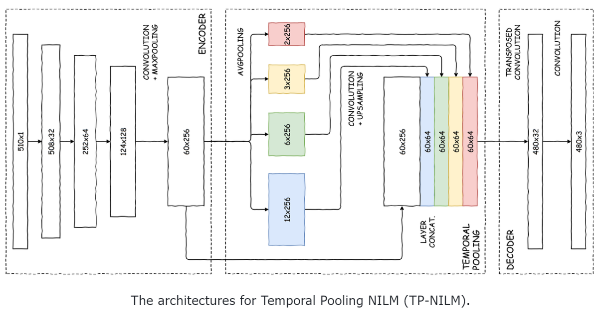
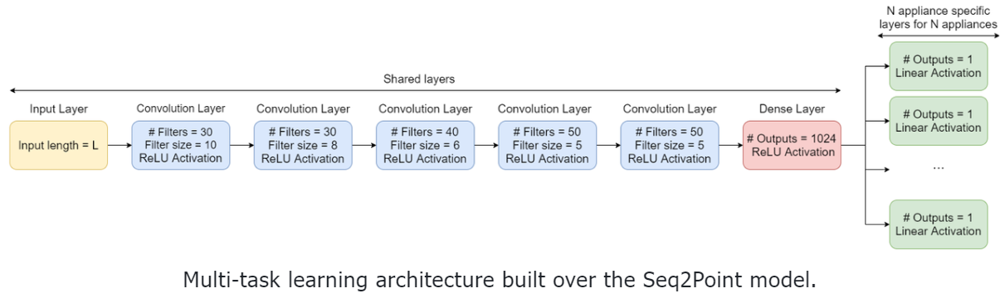
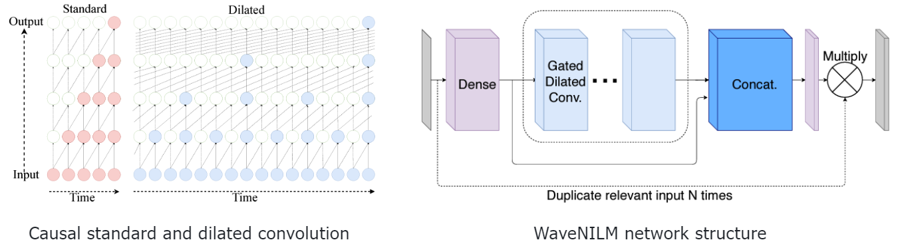
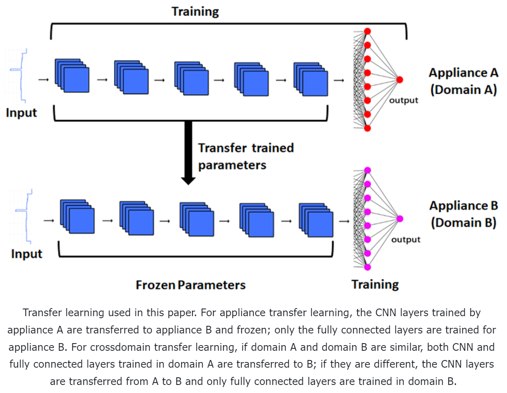
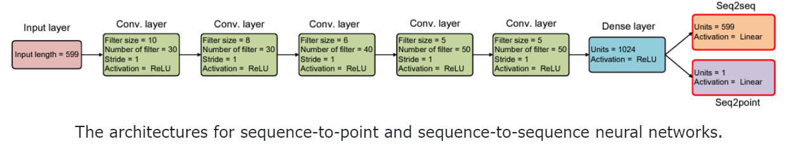

# 🌟awesome-NILM-with-code

> **A repository of awesome Non-Intrusive Load Monitoring (NILM) with code** 
>
> 😸 Welcome valuable opinions from researchers in the same direction

# 🛠️Toolkits

- NILMTK: Non-Intrusive Load Monitoring Toolkit [[PDF](https://arxiv.org/pdf/1404.3878v1.pdf)] [[CODE](https://github.com/nilmtk/nilmtk)]
- NILMTK-Contrib [[PDF](https://dl.acm.org/doi/10.1145/3360322.3360844)] [[Model](https://nipunbatra.github.io/papers/2021/buildsys.pdf)] [[Tensorflow](https://github.com/nilmtk/nilmtk-contrib)]
- NILM-Eval [[Matlab](https://github.com/beckel/nilm-eval)]
- Torch-NILM [[PDF](https://www.mdpi.com/1996-1073/15/7/2647)] [[Pytorch](https://github.com/Virtsionis/torch-nilm)]
- Deep-NILMtk [[PDF](http://nilmworkshop.org/2022/proceedings/nilm22-final4.pdf)] [[Pytorch](https://github.com/BHafsa/deep-nilmtk-v1/tree/master/deep_nilmtk/models/pytorch)] [[Tensorflow](https://github.com/BHafsa/deep-nilmtk-v1/tree/master/deep_nilmtk/models/tensorflow)]
- nilmtk-ukdale: Exploratory Data Analysis [[Pytorch](https://github.com/kehkok/nilmtk-ukdale)]
- NeuralNILM_Pytorch [[Pytorch](https://github.com/Ming-er/NeuralNILM_Pytorch)] 
- nilm_analyzer [[Pytorch](https://github.com/mahnoor-shahid/nilm_analyzer)] 

# 🧑‍🤝‍🧑Conference

- [Energy Informatics](https://energyinformatics.springeropen.com/)
- [International Workshop on Non-Intrusive Load Monitoring](http://nilmworkshop.org/2022/) [[nilmworkshop.org](https://github.com/smakonin/nilmworkshop.org)] 
- [International Conference on Power Engineering and Renewable Energy (ICPERE)](http://icpere2022.com/)

# 📊Datasets

|               Type                |                           Dataset                            |
| :-------------------------------: | :----------------------------------------------------------: |
|     **Residential datasets**      | [[UK-DALE](https://www.nature.com/articles/sdata20157)]  [[REDD](https://energy.duke.edu/content/reference-energy-disaggregation-data-set-redd)]  [[REFIT](https://pureportal.strath.ac.uk/en/datasets/refit-electrical-load-measurements-cleaned)]   [[AMpds/2](http://ampds.org/)]  [[Dataport](https://ieee-dataport.org/keywords/nilm)]  [[ECO](http://www.vs.inf.ethz.ch/res/show.html?what=eco-data)]  [[ENERTALK](https://www.nature.com/articles/s41597-019-0212-5)]  [[iAWE](https://iawe.github.io/)]  [[BLUED](http://portoalegre.andrew.cmu.edu:88/BLUED/)]  [[PLAID](https://www.nature.com/articles/s41597-020-0389-7)]  [[DRED](https://www.st.ewi.tudelft.nl/~akshay/dred/)]  [[Georges Hebrail UCI](https://archive.ics.uci.edu/ml/datasets/individual%2Bhousehold%2Belectric%2Bpower%2Bconsumption)]  [[GREEND](https://sourceforge.net/projects/greend/)]  [[HES](https://randd.defra.gov.uk/ProjectDetails?ProjectID=17359&FromSearch=Y&Publisher=1&SearchText=EV0702&SortString=ProjectCode&SortOrder=Asc&Paging=10#Description)]  [[TraceBase](https://github.com/areinhardt/tracebase)]  [[IDEAL](https://www.nature.com/articles/s41597-021-00921-y)]  [[HawkDATA]](https://github.com/WZiJ/SenSys24-Hawk) |
| **Commercial buildings datasets** | [[COMBED](https://combed.github.io/)]  [[BLOND](https://www.nature.com/articles/sdata201848)] |
|      **Industrial datasets**      | [[Industrial Machines Dataset](https://ieee-dataport.org/open-access/industrial-machines-dataset-electrical-load-disaggregation)]  [[Aachen Smart Factory](http://www.finesce.eu/Trial_Site_Aachen.html)]  [[HIPE](https://www.energystatusdata.kit.edu/hipe.php)] |
|        **Synthetic Data**         | [[SynD](https://github.com/klemenjak/SynD/)]  [[COLD](https://github.com/arx7ti/cold-nilm)]  [[FIRED](https://github.com/voelkerb/FIRED_dataset_helper)]  [[SHED](https://nilm.telecom-paristech.fr/shed/)]  [[smartsim](https://github.com/sustainablecomputinglab/smartsim)] |

# 📄Papers

## 🟦Reviews

- Neural Load Disaggregation: Meta-Analysis, Federated Learning and Beyond [[PDF](https://www.mdpi.com/1996-1073/16/2/991)] [[Pytorch](https://github.com/BHafsa/FL-NILM)] [2023] 

- Non-Intrusive Load Monitoring: A Review [[PDF](https://ieeexplore.ieee.org/stamp/stamp.jsp?tp=&arnumber=9820770)] [[Tensorflow](https://github.com/pascme05/BaseNILM)] [2022]

- NILM applications: Literature review of learning approaches, recent developments and challenges [[PDF](https://www.sciencedirect.com/science/article/abs/pii/S0378778822001220)] [2022]

- Review on Deep Neural Networks Applied to Low-Frequency NILM [[PDF](https://www.mdpi.com/1996-1073/14/9/2390)] [2021]

## 🟧Deployment

- Energy Management Using Real-Time Non-Intrusive Load Monitoring [[Arduino and Raspberry Pi-based](https://github.com/goruck/nilm)] 

- flask-NILM-app-v1 [[Flask](https://github.com/Selim321/flask-NILM-app-v1)] 
- Inverse Decomposition of Energy Consumption [[C++](https://github.com/mieskolainen/IDEC)] 

 

## 🟩Methods

### Hawk: An Efficient NALM System for Accurate Low-Power Appliance Recognition

> Non-intrusive Appliance Load Monitoring (NALM) aims to recognize individual appliance usage from the main meter without indoor sensors. However, existing systems struggle to balance dataset construction efficiency and event/state recognition accuracy, especially for low-power appliance recognition. This paper introduces Hawk, an efficient and accurate NALM system that operates in two stages: dataset construction and event recognition. In the data construction stage, we efficiently collect a balanced and diverse dataset, HawkDATA, based on balanced Gray code and enable automatic data annotations via a sampling synchronization strategy called shared perceptible time. During the event recognition stage, our algorithm pipeline integrates steady-state differential pre-processing and voting-based post-processing for accurate event recognition from the aggregate current. Experimental results show that HawkDATA takes only 1/71.5 of the collection time to collect 6.34x more appliance state combinations than the baseline. In HawkDATA and a widely used dataset, Hawk achieves an average F1 score of 93.94% for state recognition and 97.07% for event recognition, which is a 47.98% and 11.57% increase over SOTA algorithms. Furthermore, selected appliance subsets and the model trained from HawkDATA are deployed in two real-world scenarios with many unknown background appliances. The average F1 scores of event recognition are 96.02% and 94.76%. [[PDF](https://dl.acm.org/doi/pdf/10.1145/3666025.3699359)] [[Scikit](https://github.com/WZiJ/SenSys24-Hawk)] [SenSys 2024- Best AE Award] 

### MSDC: Exploiting Multi-State Power Consumption in Non-intrusive Load Monitoring based on A Dual-CNN Model 

> Leveraging recent progress on deep learning techniques, we design a new neural NILM model Multi-State Dual CNN (MSDC). Different from previous models, MSDC explicitly extracts information about the appliance’s multiple states and state transitions, which in turn regulates the prediction of signals for appliances. More specifically, we employ a dual-CNN architecture: one CNN for outputting state distributions and the other for predicting the power of each state. A new technique is invented that utilizes conditional random fields (CRF) to capture state transitions. Experiments on two real-world datasets REDD and UK-DALE demonstrate that our model significantly outperform state-of-the-art models. [[PDF]([google.com/url?sa=t&rct=j&q=&esrc=s&source=web&cd=&ved=2ahUKEwj85ozrnuOCAxXvxDgGHSwyAFsQFnoECA8QAQ&url=https%3A%2F%2Fojs.aaai.org%2Findex.php%2FAAAI%2Farticle%2Fview%2F25636%2F25408&usg=AOvVaw3CWVhzVChy8RvEEYHyHi8c&opi=89978449](https://www.google.com/url?sa=t&rct=j&q=&esrc=s&source=web&cd=&ved=2ahUKEwj85ozrnuOCAxXvxDgGHSwyAFsQFnoECA8QAQ&url=https%3A%2F%2Fojs.aaai.org%2Findex.php%2FAAAI%2Farticle%2Fview%2F25636%2F25408&usg=AOvVaw3CWVhzVChy8RvEEYHyHi8c&opi=89978449)) ] [[Pytorch](https://github.com/sub-paper/MSDC-NILM)] [2023] [AAAI]

    

### Neural Load Disaggregation: Meta-Analysis, Federated Learning and Beyond

> This paper emphasizes federated neural NILM, receiving increasing attention due to its ability to preserve end-users’ privacy. Typically, by combining several locally trained models, federated learning has excellent potential to train NILM models locally without communicating sensitive data with cloud servers. [[PDF](https://www.mdpi.com/1996-1073/16/2/991)] [[Pytorch](https://github.com/BHafsa/FL-NILM)] [2023]

    

### “I do not know”: Quantifying Uncertainty in Neural Network Based Approaches for Non-Intrusive Load Monitoring

>In this paper, we explore the question - can we learn models that tell when they are unsure? Or, in other words, can we learn models that provide uncertainty estimates? We explore recent advances in uncertainty for NN(s), evaluate 14 model variants on the publicly available REDD dataset, and find that our models can accurately estimate uncertainty without compromising on traditional metrics. We also find that different appliances in their different states have varying performance of uncertainty. We also propose "recalibration" methods and find they can improve the uncertainty estimation. [[PDF](https://dl.acm.org/doi/abs/10.1145/3563357.3564063)] [[Jax](https://github.com/VibhutiBansal-11/NILM_Uncertainty/tree/master)] [2022] 

    

### Fed-GBM: a cost-effective federated gradient boosting tree for non-intrusive load monitoring

> In this paper, we propose a cost-effective collaborative learning framework, Fed-GBM (Federated Gradient Boosting Machines), consisting of two-stage voting and node-level parallelism, to address the problems in co-modelling for NILM. [[PDF](https://dl.acm.org/doi/10.1145/3538637.3538840)] [[Scikit](https://github.com/FedGBM/FedGBM-NILM)] [2022]

    

### DeepDFML-NILM: A New CNN-Based Architecture for Detection, Feature Extraction and Multi-Label Classification in NILM Signals

> In high-frequency NILM methods, state-of-the-art approaches, mainly based on deep learning solutions, do not provide a complete NILM architecture, including all the required steps. To overcome this gap, this work presents an integrated method for detection, feature extraction, and classification of high-frequency NILM signals for the publicly available LIT-Dataset. [[PDF](https://ieeexplore.ieee.org/abstract/document/9611234)] [[Tensorflow](https://github.com/LucasNolasco/DeepDFML-NILM)] [2022]

    

### Thresholding Methods in Non-Intrusive Load Monitoring to Estimate Appliance Status

> We treat three different thresholding methods to perform this task, discussing their differences on various devices from the UK-DALE dataset. [[PDF](https://www.researchsquare.com/article/rs-1923023/v1)] [[Pytorch](https://github.com/UCA-Datalab/nilm-thresholding)] [2022]

    

### Multi-Label Appliance Classification with Weakly Labeled Data for Non-Intrusive Load Monitoring

> This paper presents an appliance classification method based on a Convolutional Recurrent Neural Network trained with weak supervision.  [[PDF](https://ieeexplore.ieee.org/document/9831435)] [[Pytorch](https://github.com/GiuTan/Weak-NILM)] [2022]

    

### ELECTRIcity: An Efficient Transformer for Non-Intrusive Load Monitoring

> Utilizing transformer layers to accurately estimate the power signal of domestic appliances by relying entirely on attention mechanisms to extract global dependencies between the aggregate and the domestic appliance signals. [[PDF](https://www.mdpi.com/1424-8220/22/8/2926)] [[Pytorch](https://github.com/ssykiotis/ELECTRIcity_NILM)] [2022] 

    

### Learning to Learn Neural Networks for Energy Disaggregation

> The research area of learning to learn (L2L) is focused on learning meta knowledge about machine learning and using it to improve the learning process. This work evaluates whether it is possible to apply L2L techniques, that learn to optimize neural networks to state-of-the art energy disaggregation algorithms and employ them to increase performance and transferability across datasets. We take a novel approach by applying L2L to energy disaggregation. [[PDF](https://github.com/jsobbe/meta_nilm/blob/thesis/thesis_jsobbe.zip)] [[Tensorflow](https://github.com/jsobbe/meta_nilm/tree/main)] [2022] [master thesis] 

    

### Deep Learning-Based Non-Intrusive Commercial Load Monitoring

>The key elements of the method are a new neural network structure called TTRNet and a new loss function called MLFL. TTRNet is a multi-label  classification model that can autonomously learn correlation information through its unique network structure. MLFL is a loss function specifically designed for multi-label classification tasks, which solves the imbalance problem and improves the monitoring accuracy for challenging loads. [[PDF](https://www.researchgate.net/publication/361988541_Deep_Learning-Based_Non-Intrusive_Commercial_Load_Monitoring/figures?lo=1)] [[Pytorch](https://github.com/shaoshuai6666/TTRNet)] [2022]

    

### Improving Non-Intrusive Load Disaggregation through an Attention-Based Deep Neural Network

> We improve the generalization capability of the overall architecture by including an encoder–decoder with a tailored attention mechanism in the regression subnetwork. The attention mechanism is inspired by the temporal attention. [[PDF](https://www.mdpi.com/1996-1073/14/4/847)] [[Tensorflow](tensorflow)] [2021]

    

### Energy Disaggregation using Variational Autoencoders

> In this paper we propose an energy disaggregation approach based on the variational autoencoders framework. The probabilistic encoder makes this approach an efficient model for encoding information relevant to the reconstruction of the target appliance consumption. [[PDF](https://arxiv.org/pdf/2103.12177.pdf)] [[Tensorflow](https://github.com/ETSSmartRes/VAE-NILM)] [2021]

    

### Sequence to point learning based on bidirectional dilated residual network for non-intrusive load monitoring

> We propose a sequence to point learning based on bidirectional dilated convolution for NILM on low-frequency data, called BitcnNILM. We compare our method with existing algorithms on low-frequency data via REDD and UK-DALE datasets. Experiments show that the superiority of our BitcnNILM in both load disaggregation and load on/off identification. [[PDF](https://www.sciencedirect.com/science/article/pii/S0142061521000776)] [[Keras](https://github.com/linfengYang/BitcnNILM)] [2021]

    

### BERT4NILM: A Bidirectional Transformer Model for Non-Intrusive Load Monitoring

> We propose BERT4NILM, an architecture based on bidirectional encoder representations from transformers (BERT) and an improved objective function designed specifically for NILM learning. We adapt the bidirectional transformer architecture to the field of energy disaggregation and follow the pattern of sequence-to-sequence learning. [[PDF](https://dl.acm.org/doi/10.1145/3427771.3429390)] [[Pytorch](https://github.com/Yueeeeeeee/BERT4NILM)] [2020]

    

### Generative Adversarial Networks and Transfer Learning for Non-Intrusive Load Monitoring in Smart Grids

> While many studies focus on achieving accurate models, few of them address the models generalizability. This paper proposes two approaches based on generative adversarial networks to achieve high-accuracy load disaggregation. Concurrently, the paper addresses the model generalizability in two ways, the first is by transfer learning by parameter sharing and the other is by learning compact common representations between source and target domains. This paper also quantitatively evaluate the worth of these transfer learning approaches based on the similarity between the source and target domains. [[PDF](https://ieeexplore.ieee.org/document/9302933)] [[Pytorch](https://github.com/Awadelrahman/GAN-NILM)] [2020]

    

### Exploring Time Series Imaging for Load Disaggregation

> The main contribution presented in this paper is a comparison study between three common imaging techniques: Gramian Angular Fields, Markov Transition Fields, and Recurrence Plots. [[PDF](https://dl.acm.org/doi/10.1145/3408308.3427975)] [[Tensorflow](https://github.com/BHafsa/image-nilm)] [2020]

    

### On time series representations for multi-label NILM

>The proposed system leverages dimensionality reduction using Signal2Vec, is evaluated on two popular public datasets and outperforms another state-of-the-art multi-label NILM system. [[PDF](https://link.springer.com/epdf/10.1007/s00521-020-04916-5?sharing_token=bTZg6CBADDbWx7UVvztexPe4RwlQNchNByi7wbcMAY4YyOCPZ8jI-u3LyC4lDtEOZIQACACm_MVY_633J4jzg0CtjGEkhvPkzOs5Z-2UGgB1P_m1_4nDnPxtIplmNRaDx7TM52V6MVQYVJPSqJEKpxv1n3RqXoEm1ZpW5amjaaA%3D)] [[Scikit-learn](https://github.com/ChristoferNal/multi-nilm)] [2020]

    

### Improved Appliance Classification in Non-Intrusive Load Monitoring Using Weighted Recurrence Graph and Convolutional Neural Networks

> We propose an appliance recognition method utilizing the recurrence graph (RG) technique and CNNs. We introduce the weighted recurrent graph (WRG) generation that, given one cycle current and voltage, produces an image-like representation with more values than the binary output created by RG. [[PDF](https://www.mdpi.com/1996-1073/13/13/3374/htm)] [[Pytorch](https://github.com/sambaiga/WRG-NILM)] [2020]

    

### UNet-NILM: A Deep Neural Network for Multi-tasks Appliances State Detection and Power Estimation in NILM

>We propose UNet-NILM for multi-task appliances' state detection and power estimation, applying a multi-label learning strategy and multi-target quantile regression.  [[PDF](https://dl.acm.org/doi/10.1145/3427771.3427859)] [[Official | Pytorch](https://github.com/sambaiga/UNETNiLM)] [[Reimplement | Pytorch](https://github.com/jonasbuchberger/energy_disaggregation)] [2020] 

    

### Non-Intrusive Load Disaggregation by Convolutional Neural Network and Multilabel Classification

>We address the problem through the recognition of the state of activation of the appliances using a fully convolutional deep neural network, borrowing some techniques used in the semantic segmentation of images and multilabel classification. [[PDF](https://www.mdpi.com/2076-3417/10/4/1454)] [[Pytorch](https://github.com/lmssdd/TPNILM)] [2020]

    

### Multi-label Learning for Appliances Recognition in NILM using Fryze-Current Decomposition and Convolutional Neural Network.

>This paper proposes the CNN-based multi-label learning approach, which links multiple loads to an observed aggregate current signal.  Apply the Fryze power theory to decompose the current features into active and non-active components and use the Euclidean distance similarity function to transform the decomposed current into an image-like representation which is used as input to the CNN.  [[PDF](https://www.mdpi.com/1996-1073/13/16/4154)] [[Pytorch](https://github.com/sambaiga/MLCFCD)] [2020]

    

### EdgeNILM: Towards NILM on Edge Devices

> We study different neural network compression schemes and their efficacy on the state-of-the-art neural network NILM method. We additionally propose a multi-task learning-based architecture to compress models further. [[PDF](https://dl.acm.org/doi/pdf/10.1145/3408308.3427977)] [[Pytorch](https://github.com/EdgeNILM/EdgeNILM)] [2020]

    

    

### eeRIS-NILM: An Open Source, Unsupervised Baseline for Real-Time Feedback Through NILM

>  In this context, the ideal NILM algorithm should be unsupervised and provide real-time consumption feedback. Solutions with these characteristics have not been sufficiently studied in the NILM bibliography. This paper introduces an attempt to address this problem, by suggesting the use of a “Live” algorithm that provides real-time feedback. The Live algorithm runs in parallel with a more robust NILM procedure, and a periodic synchronization step ensures that the two processes share the same appliance models. [[PDF](https://ieeexplore.ieee.org/stamp/stamp.jsp?tp=&arnumber=9209866)] [[Scikit](https://github.com/eeris-nilm/eeris_nilm)] [2020]

    

### Deep Learning Based Energy Disaggregation and On/Off Detection of Household Appliances

> We investigate the application of the recently developed WaveNet models for the task of energy disaggregation. [[PDF](https://arxiv.org/abs/1908.00941)] [[Pytorch](https://github.com/jiejiang-jojo/fast-seq2point)] [2019] 

    

### Wavenilm: A causal neural network for power disaggregation from the complex power signal

> We present a causal 1-D convolutional neural network inspired by WaveNet for NILM on low-frequency data. We also study using various components of the complex power signal for NILM, and demonstrate that using all four components available in a popular NILM dataset (current, active power, reactive power, and apparent power). [[PDF](https://arxiv.org/pdf/1902.08736.pdf)] [[Keras](https://github.com/picagrad/WaveNILM)] [2019]

    

### Transfer Learning for Non-Intrusive Load Monitoring

> Appliance transfer learning (ATL) and cross-domain transfer learning (CTL). [[PDF](https://arxiv.org/pdf/1902.08835.pdf)] [[Tensorflow](https://github.com/MingjunZhong/transferNILM)] [2019]

    

### Sliding Window Approach for Online Energy Disaggregation Using Artificial Neural Networks 

> We propose two recurrent network architectures that use sliding window for real-time energy disaggregation.  [[PDF](https://dl.acm.org/doi/pdf/10.1145/3200947.3201011)] [[Keras](https://github.com/OdysseasKr/online-nilm)] [2018]

    

### Subtask Gated Networks for Non-Intrusive Load Monitoring

> We propose a subtask gated network that combines the main regression network with an on/off classification subtask network. [[PDF](https://arxiv.org/pdf/1811.06692.pdf)] [[Pytorch](https://github.com/inesylla/energy-disaggregation-DL)] [2018]

    

### Sequence-to-point learning with neural networks for non-intrusive load monitoring

> We propose sequence-to-point learning, where the input is a window of the mains and the output is a single point of the target appliance. [[PDF](https://arxiv.org/pdf/1612.09106.pdf)] [[Tensorflow](https://github.com/MingjunZhong/seq2point-nilm)] [2017] [[Reimplement-Pytorch](https://github.com/mahnoor-shahid/seq2point)] 

    

### Neural NILM: Deep Neural Networks Applied to Energy Disaggregation

> We adapt three DNN architectures to energy disaggregation: 1) a form of RNN called LSTM; 2) denoising autoencoders; and 3) a network which regresses the start time, end time and average power demand of each appliance activation. [[PDF](https://www.researchgate.net/publication/280329746_Neural_NILM_Deep_Neural_Networks_Applied_to_Energy_Disaggregation)] [[Theano](https://github.com/JackKelly/neuralnilm_prototype)] [2015]

    

