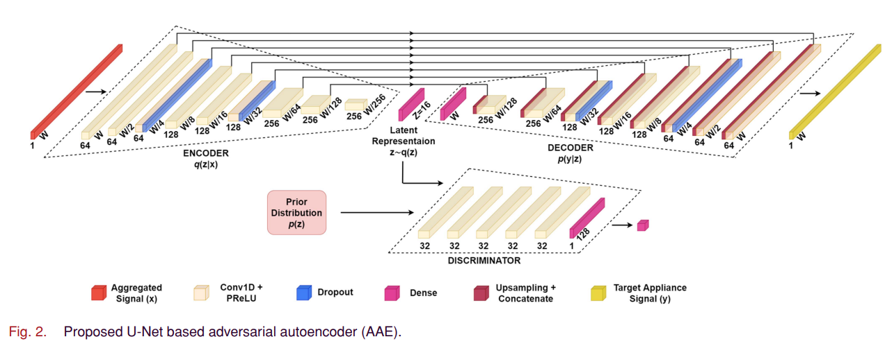
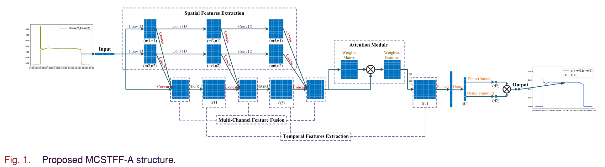
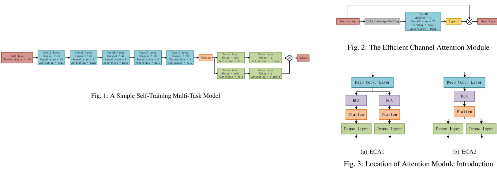
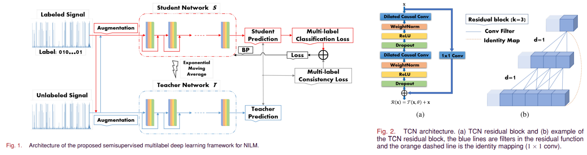

# Deep Learning-Based Probabilistic Autoencoder for Residential Energy Disaggregation: An Adversarial Approach

> In this article, a new energy disaggregation approach based on adversarial autoencoder (AAE) is proposed to create a generative model and enhance the generalization capacity. The proposed method has a probabilistic structure to handle uncertainties in the unseen data. By transforming the latent space from a deterministic structure to a Gaussian prior distribution, AAEs decoder transforms into a generative model.  [[PDF](https://ieeexplore.ieee.org/stamp/stamp.jsp?tp=&arnumber=9712173)] [2022]

    

# Multichannel Spatio-Temporal Feature Fusion Method for NILM

> In this article, a multichannel spatio-temporal feature fusion method is proposed, where the spatial features extracted by convolution neural network and the temporal features extracted by the recurrent neural network are fused. And the attention module is introduced to further improve the performance of the model. [PDF] [2022]

    

# A Self-training Multi-task Attention Method for NILM 

> In this paper, a self-training multi-task learning model is proposed. In the model, a parallel structure is used to deal with two different tasks, and the outputs of two branches are directly combined as the final output. The model only needs one loss function and is only trained once. In addition, we also introduce attention mechanism into the proposed model.  [[PDF](https://ieeexplore.ieee.org/stamp/stamp.jsp?tp=&arnumber=9858445)] [2022]

    

# Semisupervised Multilabel Deep Learning Based Nonintrusive Load Monitoring in Smart Grids

> In this article, a new semisupervised multilabel deep learning based framework is proposed to address this problem with the goal of mitigating the reliance on large labeled datasets. Specifically, a temporal convolutional neural network is used to automatically extract high-level load signatures for individual appliances. These signatures can be efficiently used to improve the feature representation capability of the framework. [[PDF](https://ieeexplore.ieee.org/document/8911216)] [2019]

    

