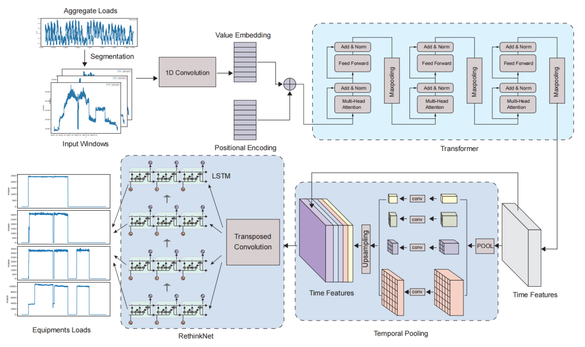

### InFocus: Amplifying Critical Feature Influence on Non-Intrusive Load Monitoring through Self-Attention Mechanisms

> However, the global features especially the dependency correlations between different positions in a sequence cannot be properly acquired. Accordingly, we devise a novel model incorporating an added attention layer to overcome this limitation. The added self-attention mechanism can automatically assign attention scores/weights to different features outputted by convolutional layers, which amplifies the positive influence of critical knowledge while realizing global reference. Moreover, this model can explicitly extract the appliance’s multi-state information, which endows the model with more interpretability. We further improve our model by substituting the added self-attention mechanism with a lightweight one, which decreases the number of model parameters while maintaining the decomposing accuracy. [[PDF](https://ieeexplore.ieee.org/abstract/document/10016661)] [2023]

    

### TransNILM: A Transformer-based Deep Learning Model for Non-intrusive Load Monitoring

> It proposes a novel transformer-based deep learning model for NILM. In this proposed model, transformer-layer enhanced convolutional neural networks (CNN) are firstly utilized for feature learning, a temporal scaling module is then developed for multi-scale information learning. Finally, these learned features are fed into a decoder which consists of three residual GRU modules and a transformer-based CNN module. [[PDF]([IEEE Xplore Full-Text PDF:](https://ieeexplore.ieee.org/stamp/stamp.jsp?tp=&arnumber=9991439))] [2022]

    

### Efficient Localness Transformer for Smart Sensor-Based Energy Disaggregation

> In this work, we propose an efficient localness transformer for non-intrusive load monitoring (ELTransformer). Specifically, we leverage normalization functions and switch the order of matrix multiplication to approximate self-attention and reduce computational complexity. Additionally, we introduce localness modeling with sparse local attention heads and relative position encodings to enhance the model capacity in extracting short-term local patterns. To the best of our knowledge, ELTransformer is the first NILM model that addresses computational complexity and localness modeling in NILM. [[PDF](https://ieeexplore.ieee.org/stamp/stamp.jsp?tp=&arnumber=9881740)] [2022]

    

### Transformer for Nonintrusive Load Monitoring: Complexity Reduction and Transferability

> In this article, we propose a middle window transformer model, termed Midformer, for NILM. Existing models are limited by high computational complexity, dependency on data, and poor transferability. In Midformer, we first exploit patchwise embedding to shorten the input length, and then reduce the size of queries in the attention layer by only using global attention on a few selected input locations at the center of the window to capture the global context. The cyclically shifted window technique is used to preserve connection across patches. We also follow the pretraining and fine-tuning paradigm to relieve the dependency on data, reduce the computation in modeling training, and enhance transferability of the model to unknown tasks and domains. [[PDF](https://ieeexplore.ieee.org/abstract/document/9745140)] [2022]

    

### ELECTRIcity: An Efficient Transformer for Non-Intrusive Load Monitoring

> Utilizing transformer layers to accurately estimate the power signal of domestic appliances by relying entirely on attention mechanisms to extract global dependencies between the aggregate and the domestic appliance signals. [[PDF](https://www.mdpi.com/1424-8220/22/8/2926)] [[Pytorch](https://github.com/ssykiotis/ELECTRIcity_NILM)] [2022] 

    

### Deep Learning-Based Non-Intrusive Commercial Load Monitoring

>The key elements of the method are a new neural network structure called TTRNet and a new loss function called MLFL. TTRNet is a multi-label  classification model that can autonomously learn correlation information through its unique network structure. MLFL is a loss function specifically designed for multi-label classification tasks, which solves the imbalance problem and improves the monitoring accuracy for challenging loads. [[PDF](https://www.researchgate.net/publication/361988541_Deep_Learning-Based_Non-Intrusive_Commercial_Load_Monitoring/figures?lo=1)] [[Pytorch](https://github.com/shaoshuai6666/TTRNet)] [2022]

    

### BERT4NILM: A Bidirectional Transformer Model for Non-Intrusive Load Monitoring

> We propose BERT4NILM, an architecture based on bidirectional encoder representations from transformers (BERT) and an improved objective function designed specifically for NILM learning. We adapt the bidirectional transformer architecture to the field of energy disaggregation and follow the pattern of sequence-to-sequence learning. [[PDF](https://dl.acm.org/doi/10.1145/3427771.3429390)] [[Pytorch](https://github.com/Yueeeeeeee/BERT4NILM)] [2020]

    

